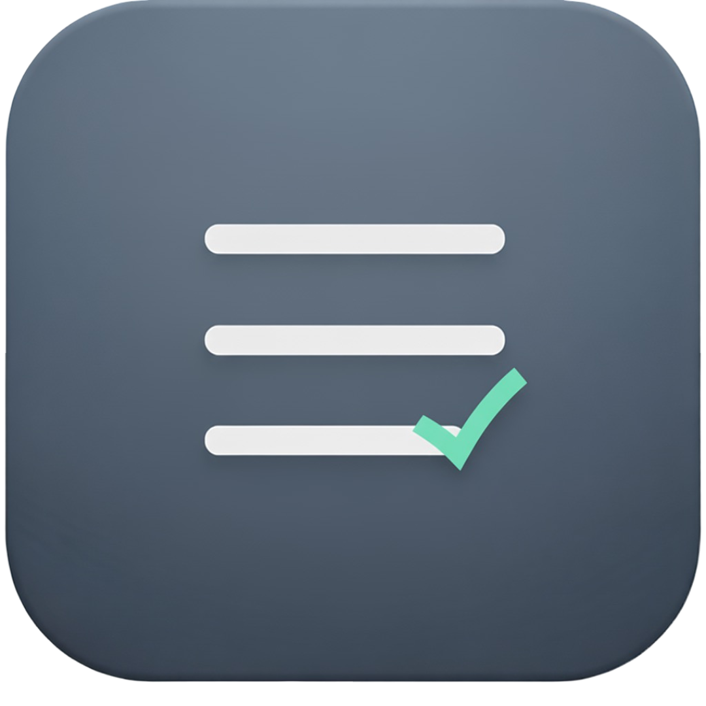
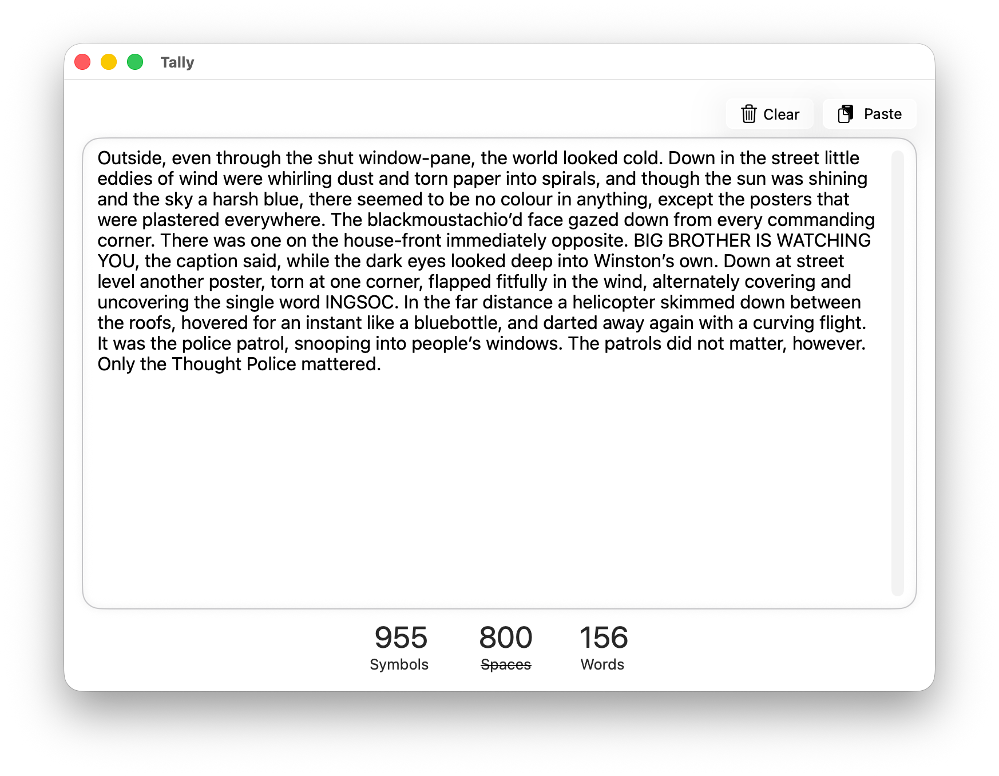

<p align="right"><b>English</b> | <a href="./README.ru.md">Русский</a></p>

#  Tally

<p align="left">
  
  
  
  
  
</p>

Tally is a simple, native, and highly performant character and word counter for macOS. Built entirely with SwiftUI, it offers a clean, minimalist interface that gets straight to the point. Just type or paste your text, and get instant counts.

## ✨ Features

- **🚀 Real-Time Counting:** Words and characters are counted as you type.
- **📋 One-Click Paste:** Instantly paste text from your clipboard.
- **🗑️ Clear All:** A dedicated button to clear the entire text area.
- **🧘 Minimalism:** A clean and intuitive interface that doesn't get in your way.
- **⚡️ Native Performance:** Built with SwiftUI for a fast and responsive experience on macOS.
- **🗂️ Large Text Support:** Handles large blocks of text with ease.

## 🖼️ Preview

<p align="center">
  
</p>

## 🚀 How to Build

To build and run Tally from the source code, follow these steps:

1.  **Clone the repository:**
    ```sh
    git clone https://github.com/teenagelove/Tally.git
    cd Tally
    ```
2.  **Open the project in Xcode:**
    ```sh
    open Tally.xcodeproj
    ```
3.  **Run the app:**
    - Select your Mac from the device list.
    - Click the "Run" button or press `Cmd+R`.

---

That's it! Enjoy a straightforward counting experience.
